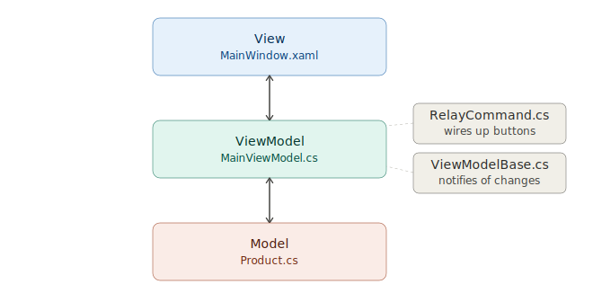

# SellerOps DevExpress Inventory Dashboard

A small C#/.NET WPF portfolio sample that demonstrates DevExpress GridControl usage in a business-app style inventory dashboard.

## Screenshot

## Currently Working On

- Adding EF Core persistence (SQLite, with optional SQL Server, MySQL, and PostgreSQL support) so inventory data is backed by a real database
- Deploying against a hosted SQL Server/MySQL database

## Features

- DevExpress WPF GridControl
- Editable marketplace inventory rows
- Search, filter, sort, and grouping support
- Dashboard metrics for product count, low stock, review items, and inventory value
- MVVM-lite structure with Models and ViewModels folders
- Clean light admin-style UI

## Architecture

## Project Structure

- `Models/` — data classes (`Product`, `ProductStatus`) with C# 14 field-backed properties for live grid editing
- `ViewModels/` — MVVM logic: `MainViewModel` (grid data, dashboard metrics, commands), `RelayCommand` (button commands), `ViewModelBase` (INotifyPropertyChanged base)
- `MainWindow.xaml` / `MainWindow.xaml.cs` — the view: DevExpress GridControl, dashboard cards, and buttons
- `App.xaml` / `App.xaml.cs` — application startup and DevExpress theme configuration

## Tech Stack

- C#
- .NET 10
- WPF
- DevExpress WPF Controls
- MVVM-style organization

## Run Locally

1. Clone the repo
2. Open `SellerOps.DevExpress.Inventory.Wpf.sln` in Visual Studio
3. Restore NuGet packages — requires a DevExpress trial or license with the DevExpress NuGet feed configured (`DevExpress.Wpf.Grid`, `DevExpress.Wpf.Editors`, `DevExpress.Wpf.Core`, `DevExpress.Wpf.Themes.Office2019Colorful`)
4. Build the solution
5. Run the app (sample inventory data loads automatically on first run)

## Why I Built This

This project was created as a focused DevExpress Udemy style learning sample for internal business applications. It is based on marketplace inventory and product listing workflows, which connect to real eCommerce operations experience.

## How I Built My Own Course to Learn Programming Concepts

I use AI (ChatGPT, Claude Code) to accelerate learning new tools and patterns — but I don't just paste in generated code, I use my own Knowledgebase to build it. The WPF app, **KnowledgeBaseViewer**, is the app I generated that turns an AI-assisted build session into a self-paced, Udemy-style guided course: sprint checklists, "why this approach" notes, and reference code I follow and actually write myself. Progress is tracked, sections are collapsible, and the course stays in my own knowledge base for later projects that reuse the same patterns. For this project, AI helped scaffold the structure and explain the DevExpress GridControl patterns; I turned that into a guided course and built it sprint by sprint so I can explain every line of it in an interview.

## Future Improvements

- CSV import/export
- Product validation rules
- DevExpress reporting
- Low-stock report screen
- Product detail panel
- Marketplace feed review workflow

